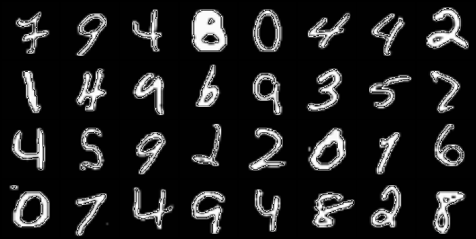

# Conditional-GAN

I train Conditional WGAN with Gradient Penalty on the MNIST dataset here.

I spent a lot of time understanding the way of correct GAN training. It's quite time-consuming.

The result that I got after 10 epochs with my better approach looks like the following.

These real images


These images were generated with the GAN model


Than I train two ResNet classifier models, one with real MNIST images and second with images from GAN model. I got the following f1 and accuracy scores.


MNIST dataset
```
accuracy_score: 0.9871 
f1_score: 0.9870849507244147
```

GAN dataset
```
accuracy_score: 0.8913
f1_score: 0.8894752379667791
```
